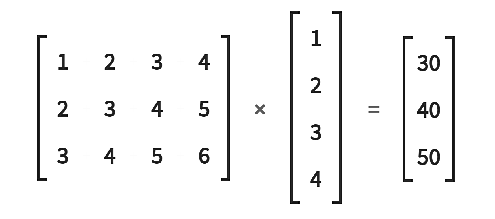

# Learnable Parameters
The Network class attributes as layers become the means to pass the dataset through and devise the forward() pass. The learnable parameters are values that get discovered during the training process.
This is where the "Arbitrary" set start off as, and are updated and filled in an iterative fashion as the network learns. To get specific when we say the network is learning we mean the network is learning those appropriate values (ther learnable ones). Appropriate values minimize the loss function.
```py
class Network(nn.Module):
    def __init__(self):
        super().__init__() # which one comes with conda...
        #super(Network, self).__init__() was a bug or lack of underscores after __init?
        # 5 layers defined as attributes
        # 2 convolutional 3 linear
        self.conv1 = nn.Conv2d(in_channels=1, out_channels=6, kernel_size=5)
        self.conv2 = nn.Conv2d(in_channels=6, out_channels=12, kernel_size=5)
        # 3 linear, fully connected layers, or also referred to as dense
        #PyTorch uses linear (nn.Linear class name)
        #this line defines the flatten from conv to linear needed---------------
        self.fc1 = nn.Linear(in_features=12 * 4 * 4, out_features=120)
        self.fc2 = nn.Linear(in_features=120, out_features=60)
        self.out = nn.Linear(in_features=60, out_features=10) # last one is OUTPUT
        
    def forward(self, t):
        # implement the forward pass
        return t
# get an instance by calling the constructor
network = Network()
```
## Init values
These init values can be other objects, nested within other objects. For our Network class this is the case. The layers of class attributes are objects themselves which are initialized with the pytorch layer classes (`Conv2d` and `Linear` above from `nn`). Use the the little 'n' network object to make the following observations. 

### Print the network object
```py
print(network)
# prints a string representation of our network.
# Network(
#     (conv1): Conv2d(1, 6, kernel_size(5, 5), stride(1, 1))
#     (conv2): Conv2d(6, 12, kernel_size(5, 5), stride(1, 1)) # growing
#     (f1): Linear(in_features=192, out_features=120, bias=True) # flattened and now looking to shrink
#     (f2): Linear(in_features=120, out_features=60, bias=True) # honey I shrunk the kids...
#     (out): Linear(in_features=60, out_features=10, bias=True) # now what- second verse, same as the first;henry the eigth I am I am
# )
```
They say the string representation comes from the nn.Module class, but isn't that a repr? The default python string representation is from the base class Object and looks something like `__main__.Network object at 0xdeadbeef`. If you go in and take out the pass of the `nn.Module` to the `class Network()` constructor and the call to `#super(...)` this is not formatted to print out your network architecture in such a nice way. Each and every class automatically extends the object class, so know what comes out the box. We use OOP concept "overriding" to have the nice string representation written into the class. Yup its the "reeper" (__repr__). So if you wish to place your own Network class string representation add in 
```py
def __repr__(self):
    return "your custom string- f formatted {} if you so wish"
```
Then when you call `print(network)` it should now print `your custom string- f formatted {} if you so wish`; and so the Module base class also overrides the __repr__()
```py
# from the Module class
#def __repr__(self):
#...
    for key, module in self._modules.items():
        mod_str = repr(module)
        mod_str = _addindent(mod_str, 2)
        child_lines.append('(' + key + '): ' + mod_str)
```
### Notice the subtle differences
We see the `kernel_size` as tuple as the filter actually has a square height and a width when we only pass in a single '5' as argument. We also have an additional `stride` parameter we could have specified but did not. When it is left out in the layer constructor, it gets automatically set to (1,1). The stride tells the conv layer how much the "slide" amount to shift for each operation in the overall convolution operation `stride=(1,1)` sets the down one unit when moving to the right and one unit when moving down. Last the `bias=True` is default for Linear class. The print is described as completely arbitrary information but python states that it should be complete enought to recreate the information (object) if needed. 

### ROV caveat
todo
When parsing log information the content recreation should be duely noted here as it will also play an integral role in back tracking, crawling the stack, obtaining f_locals, and even doing things like piping this to preprocessed information to the interpreter for production grade debugging- in real time. The "format" string output will need to be coordinated with the parsing algorithm, so if you are looking into fluent bit or splunk or whatever your flavor is, be aware of the ways directives can be parsed and likewise make the processes identical- it will save you some time for dumping diagnostic info.

## Dot notation is still good for the network
See what is in the small 'n' network object. This will also give you the strings as you describe them.
```py
network.conv1
# Conv2d(1, 6, kernel_size=(5, 5), stride(1,1))
```
This may be done for each layer because each class in turn has the repr and will out the string representation it has for the layer object.
## Weights in each layer
Now we get behind the scenes. As if we were not already.
```py
network.conv1.weight
# dumps out the tensor for the layer and its associated wieghts 
# but it starts with 
# Parameter containing:
# tensor([[[
#   [the kernel 5,5 square for 5,5 weights, all together for that one layer]
# ]]])
```
It says Parameter containing: because it is a learnable parameter. No. Its the repr in that class. But this is learnable. All of these objects are chained or linked together. These are learned as the networkis trained. These weights are updated in such a way that the loss function is minimized.

## Parameter Class
The parameter class is used to keep track of the weights. The Parameter class extends the tensor class so the weight tensor inside every layer is an instance of the Parameter class. This is why we see the Parameter containing text above the tensor output.
```py
class Paramter(torch.Tensor)
```
The in this class's override of the  __repr__() function, the prepending text parameter containing the regular tensor class representation output. This means that we see the
```py
def __repr__(self):
    return 'Parameter containing:\n' + super(Parameter, self).__repr__()
```
use of the super as it relates to extending this class. We can use this to access those methods like other OOP style methods. This one just tacks on its 21 chars with a \n and passes the buck on the food chain.

The `nn` module class is tracking this kind of activity (any attributes of a module whose values are instances of the Parameter class) in the background and if there `isinstance(value, Parameter)` of the Parameter class, the `nn` will `self.register_paramter(name, value)` to take care of it for you.

## Importance here
The interpretation of the shape, of the weight tensors is what we are after. The shape is worth interpreting. The parameter values we passed into the Network attribute layers are the key. For the convolutional layers, the weight values live inside the filters, and in code, the filters are actually the weight tensors themselves. 

Using the same dot notation we drill down to the shape
```py
# from layer self.conv1 = nn.Conv2d(in_channels=1, out_channels=6, kernel_size=5) # 1=grayscale in
network.conv1.weight.shape
# torch.Size([6,1,5,5]) # 6 = out_channels
# from layer self.conv2 = nn.Conv2d(in_channels=6, out_channels=12, kernel_size=5)
network.conv2.weight.shape
# torch.Size([12,6,5,5]) 
network.fc1.weight.shape
# torch.Size([120, 192]) 
network.fc2.weight.shape
# torch.Size([60, 120]) 
network.out.weight.shape
# torch.Size([10,60]) 
```
The convolution operation inside a layer is an operation between the input channels to the layer and the filter inside the layer. This means that what we really have is an operation between two tensors.

## Understand the weight Tensors to better understand the Convelution Operation
The shape encodes all we need to know about the tensor. So from above we deduce that the first attribute layer of out Network `conv1` we have one color channel that should be convolved ($10) by 6 filters of size 5 by 5 to produce 6 output channels. This is the interpretation we have for the values from withi our layer constructor. Inside our layer though, we do not actually have 6 explicit weight tensors for each of the 6 filters. We use a single tensor to represent all 6 weights. 

The shape of the weight tensor accounts for the 6 in the shape of the tensor. That is shown above on the first layer `conv1` as a rank-4 tensor with the first axis having a length of 6 to account for the 6 filters. The second access length of '1' to account for the single input channel or in this example we are running the grayscale image at first. The last two are the height and width of the filter, 5 by 5, but remember the constructor only took one value to make a square tensor out of.

Think of it as packaging all of our filters into one single tensor. Moving to the second layer `conv2` there are 12 filters, instead of convolving a single input channel we do the 6 from the previous layer as input. This is how we can say we give each of the 6 filters some depth. Our filter has a depth that matches the number of channels so it can slide across all channels in one go. The takeoff here is that all the filters get represented using a single tensor, and each filter has a depth that accounts for the input channels being convolved. 
## Hammer it home
So the tensors are rank 4 and the 
```py
network.conv1.weight.shape
# torch.Size([6, 1, 5, 5])
```
size places the 6 for the filters where we first started with images and [B,C,H,W]. The first axis represents the number of filters now. The second now represents the depth of each filter. The depth of the filter corresponds to the number of channels, so (2 each to comprise them as pairs) for the second conv2 we have [12,6,5,5] respectively.

* single tensor for a filter
* depth matches input channels convolved.

## Access an individual weight tensor on the convolutional layers
We can pull any single filter out with an index into the weight tensors first axis.
```py
network.conv2.weight[0].shape
# torch.Size([6, 5, 5]) depth six matches the network.conv2.weight.shape 2nd axis; height and width 5
```

## Now the Linear Layers
These have been flattened to rank-1 tensors as input- dont forget. Then we use a transform for the in_features and out_features using a rank-2 tensor called a weight matrix. The previous two steps are crucial here. This is due to the weight tensor of rank-2 with heigh and width axes. The height corresponds to the out_features, and the widtch has the length of the in_features   
```py
network.fc1.shape
# torch.Size([120, 192])
network.fc2.shape                                    
# torch.Size([60, 120])
network.out.shape
# torch.Size([10, 60]) 
```
Each Linear layer is rank-2. The height of the weight tensor has the length of the desired output features and a width of the input features. Back to linear and matrix math. Don't confuse this with the earlier broadcasting testing, it's close but no cigar here.

The first one is a 3x4 rank-2 and the second is a 4x1. The resulting MATRIX above would be a 3x1 rank-2. Remember the way to do matrix multiplication is with a dot product (which is a sum the products of the corresponding components) where each of the row/column combination outputs, the computation comes from using the corresponding row of the first matrix and the corresponding column of second matrix. It's the sum of the products together. The second matrix only has one columm so we use it all three times. This looks like
```py
(1*1) + (2*2) + (3*3) + (4*4) = 1+4+ 9+16=30
(2*1) + (3*2) + (4*3) + (5*4) = 2+6+12+20=40
(3*1) + (4*2) + (5*3) + (6*4) = 3+8+15+24=50
```
## Rules for matrix multiplication
The rules are a little different than we saw for broadcasting to see if the two matrices are compatible. Can we see what it is? The number of columns in the first has to match the number of rows in the second, and in this case it is both 4. 

## Important to Define the Weight Matrix as a function 
This may also be referred to as a Linear Map. The Linear layers are flattened from the convolutional outputs, so this multiplication of the 3x4 and 4x1 is representative of how we may work on the Linear layers within the network. The linear functions build up the neural network. The Weight Matrix (above its the 3x4) defines the Linear function. This map is how we transform a 4D vector space  (the 4x1 input) to a 3D vector space (3x1 ouput result of the matrix multiplication above).
# Real Bigger Deal
When we change the weight values within the matrix we are actually changing the function, and this is the EXACT thing we wish to do as we search for the function that our network is ultimately approximating. 

## Review
Broadcasting comparison rules for working TENSORS out. Whats the resulting shape? Why? Obey the [broadcast rules](./03-broadcast-element-wise-ops.md) and you get a prize. Then element operations can take place.

## Do the same Matrix math in pytorch with `matmul()`.
The 4x1 is the in_features.

```py
in_features = torch.tensor([1,2,3,4], dtype=torch.float32 )
weight_matrix = torch.tensor([
    [1,2,3,4],
    [2,3,4,5],
    [3,4,5,6]
], dtype=torch.float32)

weight_matrix.matmul(in_features)
# tensor([30., 40., 50.])
```

## Access all the parameters all at once?
Next up is doing this within the Linear layer itself. The above is the main learnable parameters on the network. With the discussion on the Parameters class now we can discuss how the following print method is helping us retrieve our network information. This is because of what the Module base class is doing behind the scenes from `nn/Modules/module.py`. Also notice below the bias gets spit out too. This is because for each weight tensor there is also a bias tensor.

```py
# most common way to iterate over our weights during our training process
# we inherit this parameter method from the 'nn' base class
for param in network.parameters():
    print(param.shape)

torch.Size(6, 1, 5, 5)
torch.Size([6])
torch.Size([12, 6, 5, 5])
torch.Size()
torch.Size([12])
torch.Size([120, 192])
torch.Size([120])
torch.Size([60,120])
torch.Size([60])
torch.Size([10,60])
torch.Size([10])

# if we want to see the names too, that is convenient
# you may have noticed the prefab module.py has something similar to below, with async yield param
for name, param in network.named_parameters():
    print(name, '\t\t', param.shape)

# conv1.weight        torch.Size(6, 1, 5, 5)
# conv1.bias      torch.Size([6])
# conv2.weight        torch.Size([12, 6, 5, 5])
# conv2.bias      torch.Size([12])
# fc1.weight      torch.Size([120, 192])
# fc1.bias        torch.Size([120])
# fc2.weight      torch.Size([60, 120])
# fc2.bias        torch.Size([60])
# out.weight      torch.Size([10,60])
# out.bias        torch.Size([10])

# what about enumerate?
```
## Speed is the key
We can use this inherited `def parameters(self, recurse=True)` from the nn modules parameters to get the learnable parameters out quickly. The bias is also included as a learnable. There is a deep dive on bias available too.